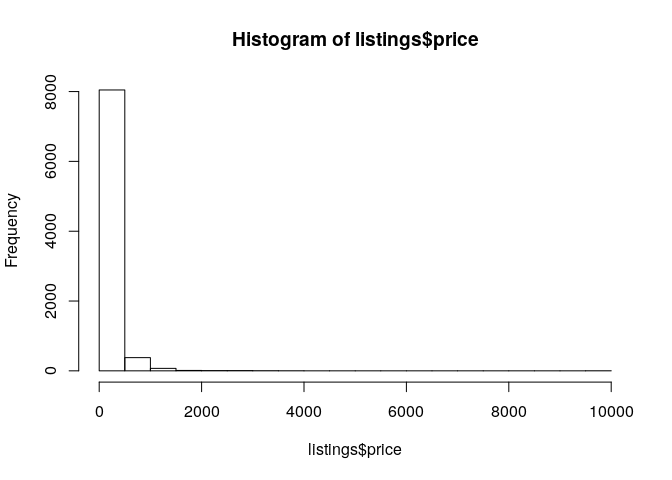
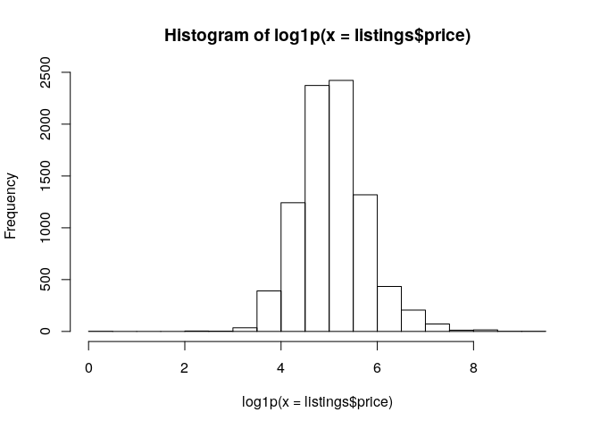
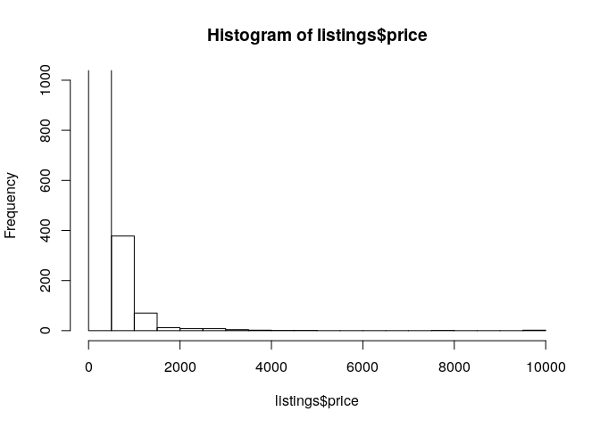
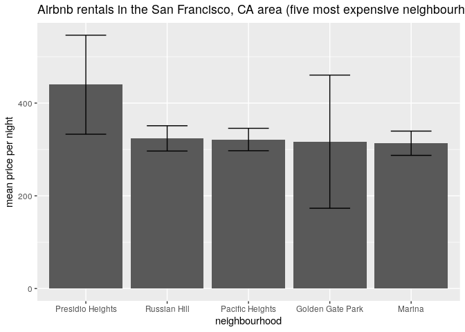

Airbnb listings in San Francisco, CA, USA
================
stevan

##### data frame: structure

    ## 'data.frame':    8533 obs. of  16 variables:
    ##  $ id                            : int  958 3850 5858 7918 8142 8339 8739 9225 10251 10578 ...
    ##  $ name                          : chr  "Bright, Modern Garden Unit - 1BR/1B" "Charming room for two" "Creative Sanctuary" "A Friendly Room - UCSF/USF - San Francisco" ...
    ##  $ host_id                       : int  1169 4921 8904 21994 21994 24215 7149 29674 35199 37049 ...
    ##  $ host_name                     : chr  "Holly" "Kevin" "Philip And Tania" "Aaron" ...
    ##  $ neighbourhood_group           : logi  NA NA NA NA NA NA ...
    ##  $ neighbourhood                 : chr  "Western Addition" "Inner Sunset" "Bernal Heights" "Haight Ashbury" ...
    ##  $ latitude                      : num  37.8 37.8 37.7 37.8 37.8 ...
    ##  $ longitude                     : num  -122 -122 -122 -122 -122 ...
    ##  $ room_type                     : chr  "Entire home/apt" "Private room" "Entire home/apt" "Private room" ...
    ##  $ price                         : int  170 99 235 65 65 585 139 135 199 120 ...
    ##  $ minimum_nights                : int  1 1 30 32 32 5 1 1 30 30 ...
    ##  $ number_of_reviews             : int  226 175 111 18 8 28 713 523 337 18 ...
    ##  $ last_review                   : chr  "2019-11-17" "2019-12-01" "2017-08-06" "2019-09-10" ...
    ##  $ reviews_per_month             : num  1.79 1.38 0.86 0.14 0.13 0.23 5.66 4.25 2.71 0.19 ...
    ##  $ calculated_host_listings_count: int  1 3 1 9 9 2 2 1 1 1 ...
    ##  $ availability_365              : int  71 74 1 365 365 365 0 1 0 364 ...

data frame: variable
    names

    ##  [1] "id"                             "name"                          
    ##  [3] "host_id"                        "host_name"                     
    ##  [5] "neighbourhood_group"            "neighbourhood"                 
    ##  [7] "latitude"                       "longitude"                     
    ##  [9] "room_type"                      "price"                         
    ## [11] "minimum_nights"                 "number_of_reviews"             
    ## [13] "last_review"                    "reviews_per_month"             
    ## [15] "calculated_host_listings_count" "availability_365"

##### histogram: Airbnb listings price

<!-- -->

##### histogram: Airbnb listings price (ln+1 transformed)

<!-- -->

##### histogram: Airbnb listings price (ln+1 transformed), contrained y-axis

<!-- -->

##### result: table (Tibble) of neighborhoods (n = 5) with the highest average rental rates

    ## # A tibble: 5 x 5
    ##   neighbourhood    count priceMean priceSD priceSE
    ##   <chr>            <int>     <dbl>   <dbl>   <dbl>
    ## 1 Presidio Heights    23      440.    512.   107. 
    ## 2 Russian Hill       189      324.    375.    27.3
    ## 3 Pacific Heights    161      321.    307.    24.2
    ## 4 Golden Gate Park     5      317.    321.   144. 
    ## 5 Marina             194      313.    364.    26.2

##### result: plot of neighborhoods (n = 5) with the highest average rental rates

<!-- -->

##### Q1: did filtering the data change which neighborhoods were identified as having the highest rental rates?

YOUR RESPONSE FOR Q1 GOES HERE.

##### Q2: ultimately, did you filter the data, why or why not?

YOUR RESPONSE FOR Q2 GOES HERE.
